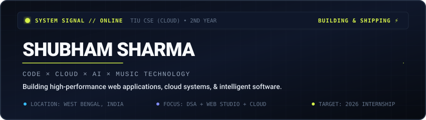
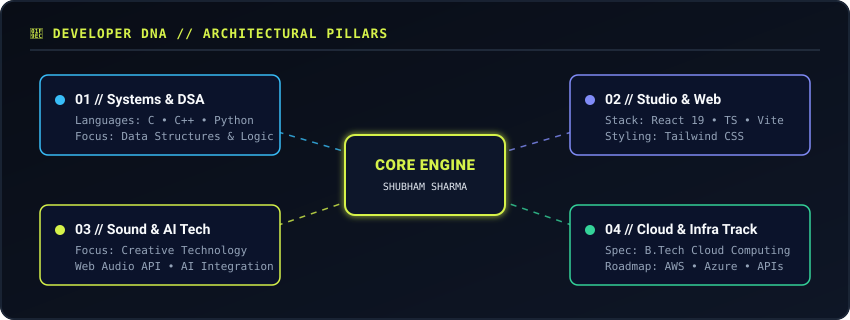
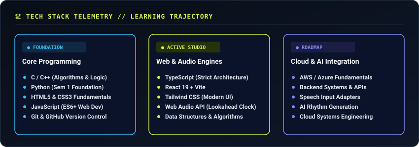
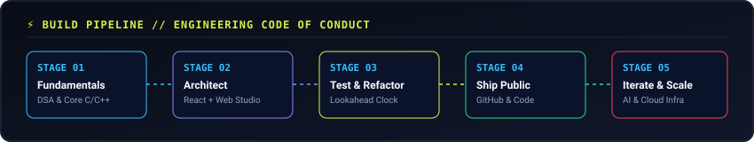

<div align="center">

<!-- HERO BANNER -->


<br/>

```
[ SYSTEM STATUS ] TIU CSE (CLOUD) // 2ND YEAR // TARGETING 2026 INTERNSHIP
```

</div>

---

### `01 // ABOUT` — SYSTEM IDENTITY

I am **Shubham Sharma**, a 2nd-year B.Tech Computer Science Engineering student specializing in **Cloud Computing** at **Techno India University (TIU), West Bengal**.

My journey is driven by a deep technical curiosity at the intersection of **Computer Science, Cloud Systems, AI Intelligence, and Audio Technology**. Rather than claiming premature expertise, I am actively building a rock-solid engineering foundation by understanding fundamentals, writing clean code, and building real-world applications in public.

- 🎓 **Degree & Spec**: B.Tech CSE — Cloud Computing @ Techno India University
- 🚀 **Current Focus**: Data Structures & Algorithms, Web Studio Architecture, Web Audio Engines, & Cloud Fundamentals
- 🎯 **Target Goal**: Securing a high-impact Software Engineering / Cloud Internship in 2nd Year

---

### `02 // ARCHITECTURE` — DEVELOPER DNA

<div align="center">
  
</div>

<br/>

My technical stack evolves across 4 interconnected engineering pillars:
1. **Systems & Algorithms**: Building problem-solving speed & algorithmic rigor in C/C++ and Python.
2. **Studio & Web Engineering**: Crafting fluid, reactive studio interfaces with React 19, TypeScript, Vite, & Tailwind CSS.
3. **Audio Engine & AI Intelligence**: Scheduling precise micro-timing audio loops using the Web Audio API & designing speech adapter architectures.
4. **Cloud Infrastructure Track**: Academic specialization in Cloud Computing, targeting AWS/Azure system engineering.

---

### `03 // TECH STACK` — TELEMETRY & TRAJECTORY

<div align="center">
  
</div>

<br/>

| Domain | Active Technologies | Level / Stage |
| :--- | :--- | :--- |
| **Languages** | `C` • `C++` • `Python` • `JavaScript (ES6+)` • `TypeScript` | **Active Foundation** |
| **Frontend & UI** | `React 19` • `Vite` • `Tailwind CSS` • `HTML5/CSS3` • `Lucide React` | **Studio Development** |
| **Audio & Engines** | `Web Audio API` • `Lookahead Schedulers` • `Speech Adapter Spec` | **Active Engineering** |
| **Cloud & Infra** | `AWS / Azure Fundamentals` • `Git / GitHub` • `MinGW` • `Node.js` | **Cloud Specialization** |
| **Engineering Concepts** | `Data Structures & Algorithms` • `State Management` • `Clean Architecture` | **Daily Focus** |

---

### `04 // BUILD PIPELINE` — ENGINEERING CODE OF CONDUCT

<div align="center">
  
</div>

<br/>

```
01. LEARN FUNDAMENTALS  --> Master core programming, C/C++, & DSA principles.
02. ARCHITECT & BUILD   --> Turn ideas into real functional prototypes.
03. TEST & REWRITE      --> Profile performance, fix race conditions, & optimize timing.
04. SHIP IN PUBLIC      --> Commit regularly, document transparently, & deploy.
05. ITERATE & GROW      --> Expand toward Cloud systems, APIs, & AI integration.
```

---

### `05 // ROADMAP` — LEARNING & CAREER TELEMETRY

```
┌─────────────────────────────────────────────────────────────────────────────┐
│ 2026 :: STAGE 1 — FOUNDATION & STUDIO ENGINEERING                           │
│ ├─ [★] Strengthen C/C++ and Data Structures & Algorithms (DSA)               │
│ ├─ [★] Master React 19, TypeScript, and Tailwind CSS web development        │
│ └─ [ ] Target 2nd-Year Software Engineering / Web / Cloud Internship        │
├─────────────────────────────────────────────────────────────────────────────┤
│ 2026–2027 :: STAGE 2 — CLOUD & BACKEND EXPANSION                            │
│ ├─ [ ] Deepen Cloud Computing specialization (AWS & Azure certification track)│
│ ├─ [ ] Build scalable REST APIs & Backend microservices                      │
│ └─ [ ] Advanced DSA, System Design fundamentals, & Open-Source building      │
├─────────────────────────────────────────────────────────────────────────────┤
│ FUTURE :: STAGE 3 — SYSTEMS & AI ENGINEERING                                │
│ ├─ [ ] Distributed Cloud Architecture & Scalable Infrastructure             │
│ ├─ [ ] AI-Powered Creative Audio & Speech Applications                      │
│ └─ [ ] High-performance full-stack engineering at scale                      │
└─────────────────────────────────────────────────────────────────────────────┘
```

---

### `06 // TELEMETRY` — LIVE GITHUB CONTRIBUTION GRAPH & ACTIVITY

<div align="center">

<!-- Actual Real GitHub Contribution Graph -->


<br/><br/>

<!-- Real Animated Contribution Snake (Generated from actual contributions) -->
<picture>
  <source media="(prefers-color-scheme: dark)" srcset="https://raw.githubusercontent.com/shubhamsharma78899-ops/shubhamsharma78899-ops/output/github-user-contribution-grid-snake-dark.svg" />
  <source media="(prefers-color-scheme: light)" srcset="https://raw.githubusercontent.com/shubhamsharma78899-ops/shubhamsharma78899-ops/output/github-user-contribution-grid-snake.svg" />
  
</picture>

<br/><br/>

<!-- Live GitHub Stats, Streak, and Language Telemetry -->


</div>

---

### `07 // DISPATCH` — CONNECT & NETWORK

| Channel | Link / Address | Status |
| :--- | :--- | :--- |
| ⚡ **GitHub Profile** | [@shubhamsharma78899-ops](https://github.com/shubhamsharma78899-ops) | Active |
| 💼 **LinkedIn** | [shubham-sharma-b08386370](https://www.linkedin.com/in/shubham-sharma-b08386370) | Connected |
| ✉️ **Email** | [shubhamsharma78899@gmail.com](mailto:shubhamsharma78899@gmail.com) | Direct Contact |

---

### `08 // END OF LINE`

<div align="center">
  
</div>
